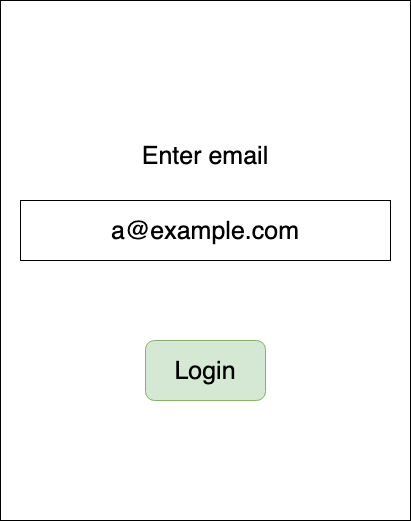
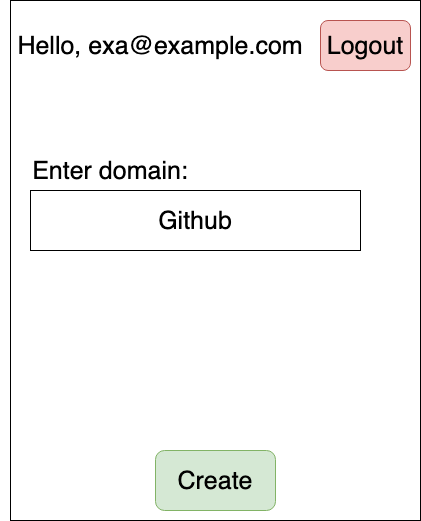
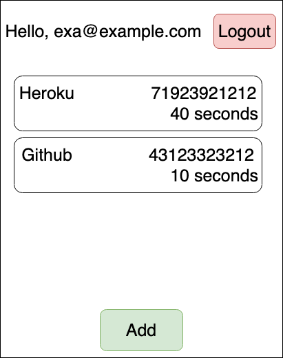

# Mock Authenticator

Google authenticator alike project.
Creates 10 character length unique identifier that belong to produced domain.

Core functionalities:
+ Ability to logging in with given address.
+ Ability to create a subscription for a domain, example: GitHub, Microsoft, Heroku, etc.
+ Ability to create a unique identifier for subscribed domains.
+ Ability to return code if created and not expired.

## Drawings for project

